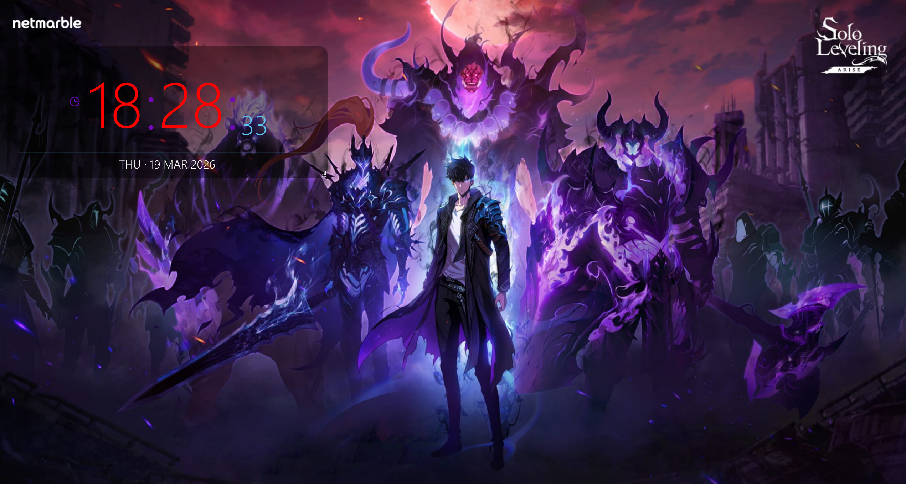
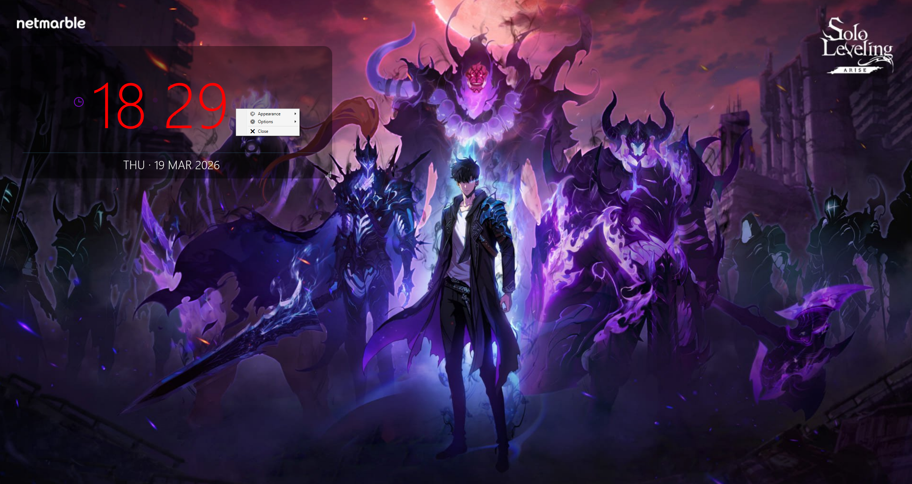
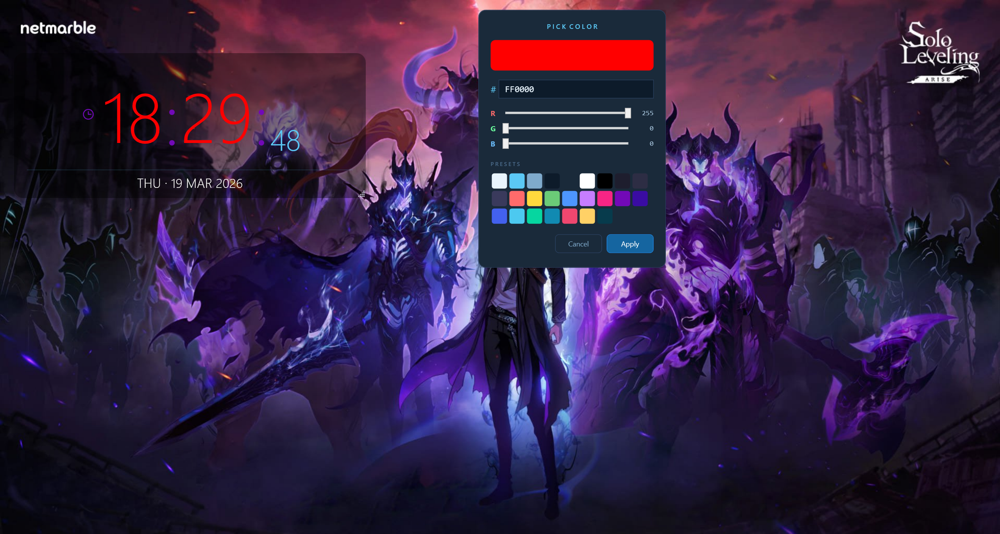
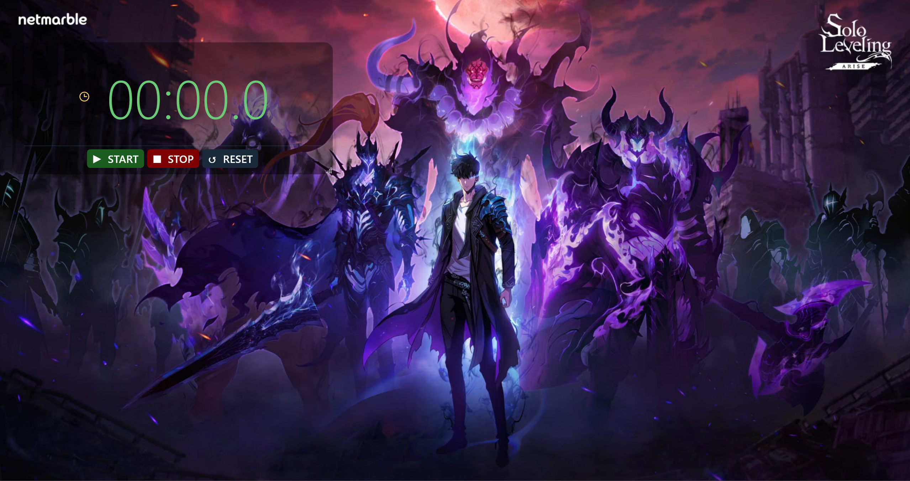

# 🕐 Clock Widget

A lightweight, frameless desktop clock widget for Windows. Sits on your desktop with full transparency support, per-monitor DPI awareness, and a built-in stopwatch — all customisable via right-click.

---

## Screenshots

## 📸 Screenshots

| Main View | right_click | color pick | StopWatch |
|  |  |  |  |

---

## Installation

1. Go to the [**Releases**](../../releases) page
2. Download the latest `.zip`
3. Extract anywhere and run `ClockWidget.exe`

No installer needed. The widget saves its settings automatically to `%AppData%\ClockWidget\settings.json`.

---

## Features

- **Frameless & transparent** — blends into any desktop wallpaper
- **Live clock** — hours, minutes, seconds with animated colon blink
- **Date display** — toggleable, sits below the clock
- **Built-in stopwatch** — switch modes with the icon button
- **Always on Top** — optional, keeps it above other windows
- **Start with Windows** — registers/removes itself from the startup registry
- **Multi-monitor support** — remembers which monitor and position across restarts
- **Resizable** — drag the grip to resize; all font sizes scale with the window
- **Full colour customisation** — every element has its own colour picker
- **Background opacity slider** — from fully transparent to solid

---

## Settings & Customisation

Right-click anywhere on the widget to open the context menu.

### 🎨 Appearance

| Setting | Description |
|---|---|
| Clock Color | Colour of the hours and minutes digits |
| Colon Color | Colour of the blinking colon separator |
| Seconds Color | Colour of the seconds digits and accent line |
| Date Color | Colour of the date text |
| Background Color | Fill colour of the widget background |
| Stopwatch Time Color | Colour of the stopwatch digits |
| Background Opacity | Slider from 0% (invisible) to 100% (solid) |

### ⚙️ Options

| Setting | Description |
|---|---|
| Show Seconds | Toggles the seconds display |
| Show Date | Toggles the date row |
| Always on Top | Keeps the widget above all other windows |
| Start with Windows | Adds or removes the widget from Windows startup |

---

## License

MIT
